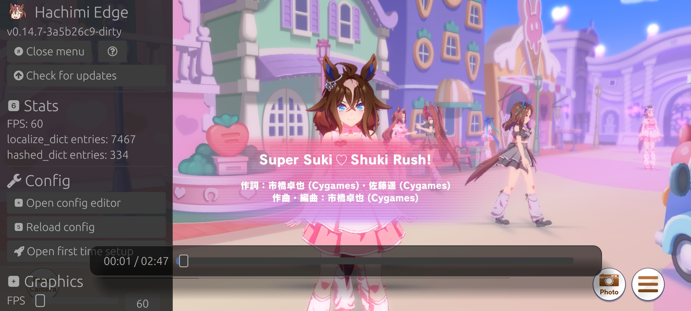

# Hachimi Edge

[English](README.md) | [简体中文](README-zh_cn.md) | [繁體中文](README-zh_tw.md) | Filipino

Game enhancement at translation mod para sa UM:PD.

# ⚠️ Huwag mag-link sa repo na ito o sa Hachimi Edge website

Naiintindihan namin na gusto mong tulungan ang mga tao na i-install ang Hachimi at magkaroon ng mas-magandang experience sa paglalaro. Pero labis na nilalabag ng proyektong ito ang TOS ng laro at alam namin na gusto ng game developer na mawala na ang proyektong ito kapag malaman nila.

Habang okay lang ang pag-share sa self-managed na chat services at pribadong pagmemensahe, hinihingi namin sa iyo na huwag magbahagi ng mga link papunta sa proyektong ito o sa mga tool na may kinalaman sa proyektong ito sa mga pampublikong website tulad ng Facebook

O i-share mo na lang sila at sirain ito para sa maraming Hachimi users. Ikaw na ang bahala.

### Kung gusto mo pa rin ibahagi
Gawin mo lang gagawin mo, pero hinihiling namin na subukan mong i-label ang laro bilang "UMPD" o "honse game" sa halip ng aktual na pangalan ng laro, para iwasan ang pag-index ng mga search engine sa proyektong ito.

# Features
- **Mataas na kalidad na translations:** May kasamang advanced na translation features ang Hachimi na nakakatulong sa pagiging-natural ng translations (plural forms, ordinal number, atbp.) at pag-iwas ng jank sa UI. Sinusuportahan rin nito ang pag-translate ng game components; walang kinakailangang manwal na pag-patch ng assets!

    Sinusuportahang components:
    - UI text
    - master.mdb (pangalan at paglalarawan ng skill, atbp.)
    - Race story
    - Main story/Home dialog
    - Lyrics
    - Texture replacement
    - Sprite atlas replacement

    Dagdag pa nito, hindi lamang binibigay ng Hachimi ang mga translation featres para sa isang wika; dinisenyo ito para fully configurable ito sa anumang wika.

- **Madaling i-set up:** Plug and play lang. Ginagawa sa laro mismo ang pag-set up, walang kinakailangang external app.
- **Pag-auto update ng translations:** Ang kasamang translation updater ay nagbibigay-daan sa iyo na laruin pa rin ang laro habang naga-update pa ang mga translations, at nire-reload ang laro kapag tapos na. Hindi na kailangang mag-restart!
- **Built-in GUI:** Comes with a config editor so you can modify settings without even exiting the game!
- **Built-in GUI:** May kasamang config editor para baguhin mo ang mga setting kahit na hindi ka umalis sa laro!
- **Graphics settings:** Maaari mong i-adjust ang graphics settings ng laro upang lubos na magamit ang specs ng iyong device, tulad ng pag-unlock ng FPS at resolution scaling
- **Cross-platform:** Dinisenyo para maging portable, na may support sa Windows at Android.

# Installation
Tignan ang ["Magsimula"](https://hachimi.noccu.art/fil/docs/hachimi/getting-started.html) na pahina.

# Espesyal na pasasalamat
Ang mga proyektong ito ang naging batayan sa pag-develop ng Hachimi; kung wala ang mga ito, hindi sana umiral ang Hachimi sa kasalukuyang anyo nito:

- [Trainers' Legend G](https://github.com/MinamiChiwa/Trainers-Legend-G)
- [umamusume-localify-android](https://github.com/Kimjio/umamusume-localify-android)
- [umamusume-localify](https://github.com/GEEKiDoS/umamusume-localify)
- [Carotenify](https://github.com/KevinVG207/Uma-Carotenify)
- [umamusu-translate](https://github.com/noccu/umamusu-translate)
- [frida-il2cpp-bridge](https://github.com/vfsfitvnm/frida-il2cpp-bridge)

# Lisensya
[GNU GPLv3](LICENSE)
