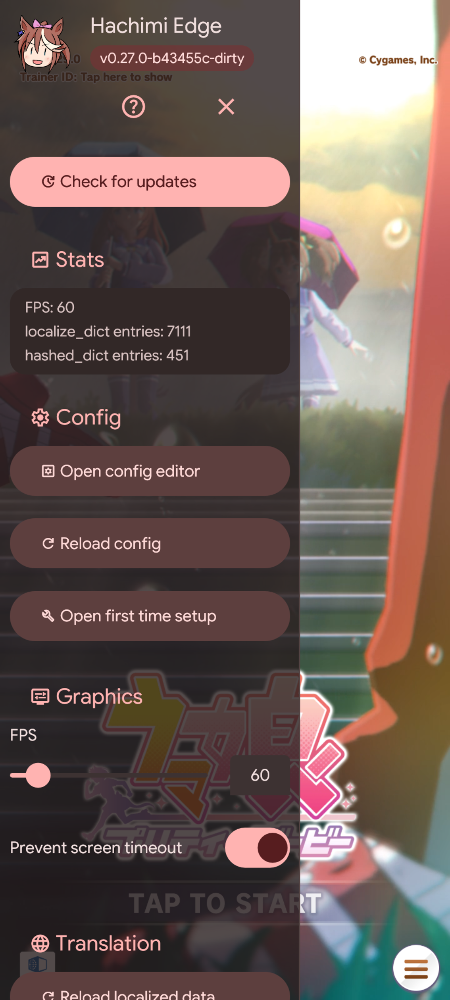

  
  <h1>Hachimi Edge</h1>
  
<b>Game enhancement and translation mod for UM:PD</b>

  
English | <a href="README-zh_cn.md">简体中文</a> | <a href="README-zh_tw.md">繁體中文</a>

  

     
  

  

    
    
  

  

## Sharing & Redistribution Guidelines

This project modifies game runtime behavior and violates the target application's Terms of Service (TOS). To minimize risk to the project and its userbase, please observe the following guidelines:

- **Do not post direct links** to this repository, project website, or associated tools on public websites, forums, or social media platforms.
- Share information exclusively via direct private messaging or self-managed community groups.
- When referencing the target application publicly, use indirect references (such as "UM:PD" or "The Honse Game") to prevent search engine indexing.

## Features

- **High-Quality Localizations:** Advanced text formatting support (plural forms, ordinal numbers, dynamic layout fitting) without manual asset modifications.
  - Supported components:
    - UI Text
    - Database entries (`master.mdb`, skill names, descriptions)
    - Race stories and main scenario dialogs
    - Song lyrics
    - Dynamic texture and sprite atlas replacement
  - Configurable language system supporting custom localization dictionaries.
- **In-Game Configuration:** Embedded GUI configuration editor allows real-time tuning of settings without restarting the application.
- **Automatic Localization Updates:** Integrated updater downloads and reloads updated translation packages directly within the game runtime.
- **Graphics Enhancement:** Device optimization features including target frame rate unlocking (FPS unlock) and resolution scaling.
- **Cross-Platform:** Native support for Windows (DirectX 11 proxy DLL) and Android (Zygisk / Dobby inline hooks).

## Installation

Refer to the official [Getting Started Documentation](https://hachimi.noccu.art/docs/hachimi/getting-started.html).

## Building from Source

Detailed compilation and environment setup instructions are documented in [BUILDING.md](BUILDING.md).

## Credits & References

Hachimi Edge incorporates concepts and techniques established by the following open-source projects:

- [Trainers' Legend G](https://github.com/MinamiChiwa/Trainers-Legend-G)
- [umamusume-localify-android](https://github.com/Kimjio/umamusume-localify-android)
- [umamusume-localify](https://github.com/GEEKiDoS/umamusume-localify)
- [Carotenify](https://github.com/KevinVG207/Uma-Carotenify)
- [umamusu-translate](https://github.com/noccu/umamusu-translate)
- [frida-il2cpp-bridge](https://github.com/vfsfitvnm/frida-il2cpp-bridge)

## License

This project is licensed under the [GNU General Public License v3.0](LICENSE).
